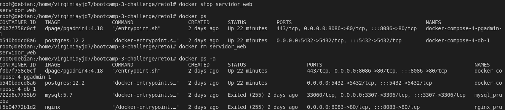

# Clase 4 - Docker

## Solucion Ejercicio - Inicial 

1. Pantallazo donde se vea la creación del contenedor y podamos comprobar que el contenedor está funcionando.
   

2. Pantallazo donde se vea el acceso al servidor web utilizando un navegador web (recuerda que tienes que acceder a la ip del ordenador donde tengas instalado
docker)
   

3. Pantallazo donde se vean las imágenes que tienes en tu registro local.
   
4. Pantallazo donde se vea cómo se elimina el contenedor (recuerda que antes debe
estar parado el contenedor).
   

### Entregable:

- Armar un script en Bash con todos los pasos para crear el contenedor
  [Link](https://github.com/virginiayjd7/bootcamp-3-challenge/blob/master/reto1/reto1.sh)

- Armar una solucion.md y usando Markdown y agregar las images de la solución:
  
  [Link](https://github.com/virginiayjd7/bootcamp-3-challenge/blob/master/reto1/solucion.md)

