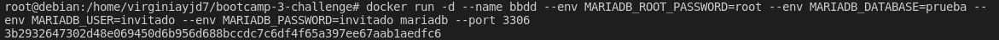
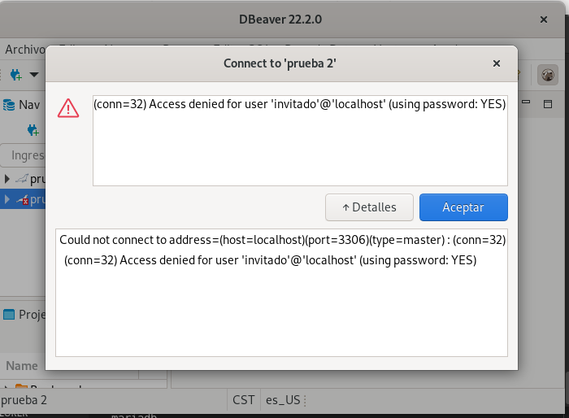
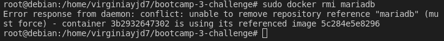

# Clase 4 - Docker

## 2. Solucion Ejercicio - Trabajo con imágenes

### Servidor de base de datos

1. Arrancar un contenedor que se llame `bbdd` y que ejecute una instancia de la imagen **mariadb** para que sea accesible desde el puerto 3306. Establecer variables de entorno.

   
   ​	Lanzamos el comando en primer plano para poder leer los posibles mensajes de error que puedan surgir mientras trabajamos desde otra consola. 
   
   
  
 2. Pantallazo de la conexión al servidor de base de datos con el usuario creado y de la base de datos `prueba` creada automáticamente.
   

Y comprobamos que podemos acceder a la base de datos y que nuestro esquema `prueba` está creado

- ERROR
  
   

```bash
ERROR 1045 (28000): Access denied for user 'invitado'@'localhost' (using password: YES)
```


1. Pantallazo donde se comprueba que no se puede borrar la imagen `mariadb` mientras el contenedor `bbdd` está creado.
  
   

  

