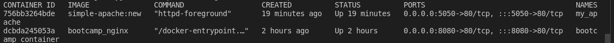

# Clase 4 - Docker

### Contenedores Docker 

### Solucion Ejercicio 1 - Crear imagen de `Apache`
Crea una imagen con un servidor web Apache y el mismo contenido que en la carpeta [content](https://raw.githubusercontent.com/roxsross/bootcamp-3-challenge/master/retos/sesion2/content).

Fíjate en el [Dockerfile](https://raw.githubusercontent.com/roxsross/bootcamp-3-challenge/master/reto4/Dockerfile) de abajo de ```simple-nginx```.


1. Buscar en ```Docker Hub``` la imagen de ```Apache```
3. Cambiar los valores para que:
   1. La imagen base sea este otro servidor
   2. El contenido se copie donde apache sirve los archivos.

Usa docker build para crear la imagen llamada ```simple-apache:new```


### Ejercicio 2 - Crear contenedor desde la nueva imagen

Ejecutar tu nueva imagen
El contenedor se debe llamar ```my_apache```
Debes usar el puerto __5050__ de tu __localhost__ para poder acceder a él.



__Resultado:__


### Ejercicio 3 - Inspeccionar la imagen

Averiguar cuántas capas tiene mi nueva imagen
## Contiene 6 capas
