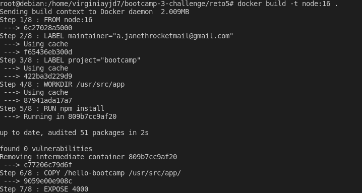

# Clase 4 - Docker

### Ejercicio 1 - Containerizar aplicacion `Node.js`

Dockeriza la carpeta [Dockerfile](https://github.com/virginiayjd7/bootcamp-3-challenge/blob/master/reto5/Dockerfile)

- Ejecuta un contenedor con la imagen
  

- Subir la aplicacion en registry
  
  

- Crear el Script que permita realizar todo lo antes mencionado
[script-reto5](https://github.com/virginiayjd7/bootcamp-3-challenge/blob/master/reto5/reto5.sh)

Resultado:

### Entregable:

- Armar una solucion.md y usando Markdown :

- Documentacion [Markdown](https://docs.github.com/es/get-started/writing-on-github/getting-started-with-writing-and-formatting-on-github/basic-writing-and-formatting-syntax)

- Crear Dockerfile

- Subir Registry DockerHub